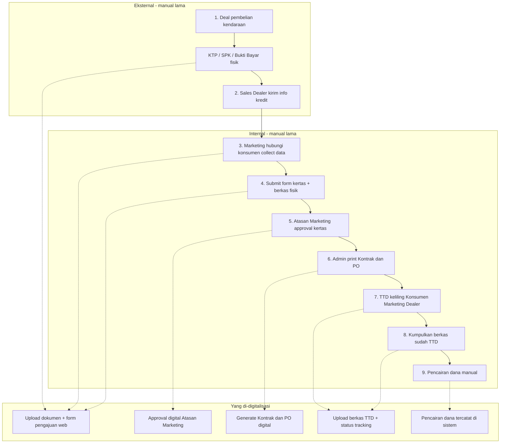
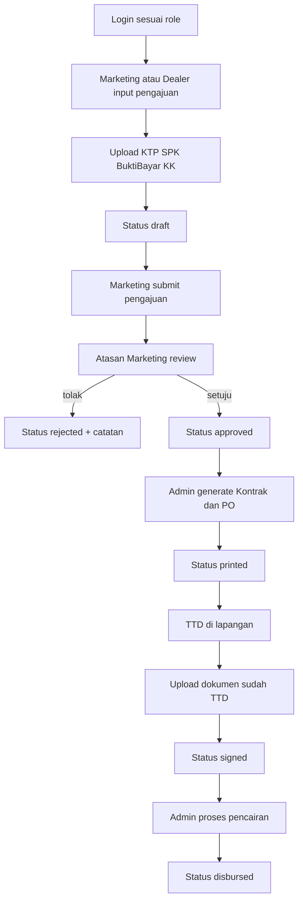
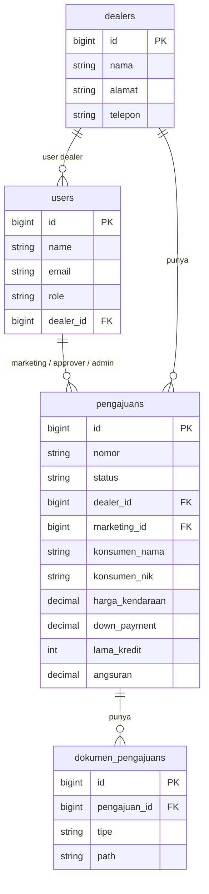

# JKL Finance — Digitalisasi Pengajuan Kredit Kendaraan

Aplikasi web untuk **PT. JKL** (soal coding PDP BCA Finance, nomor **2.A**). Proses penerimaan pengajuan kredit kendaraan yang tadinya manual (fotokopi, scan, print, routing kertas) dipindah ke sistem: input data, unggah dokumen, approval atasan, cetak kontrak/PO, unggah berkas TTD, sampai pencairan dana.

## Soal 1 — Proses yang didigitalisasi

Hampir seluruh langkah 1–9 bisa diimprove:

| Langkah lama | Digitalisasi |
|---|---|
| Tukar dokumen fisik (KTP, SPK, bukti bayar, KK) | Upload ke sistem |
| Form aplikasi kertas | Form web + simpan database |
| Approval atasan via kertas | Approve / reject di aplikasi |
| Print kontrak & PO manual | Generate dokumen digital lalu cetak |
| TTD keliling fisik | Tracking status + upload berkas sudah TTD |
| Pencairan dana tidak tercatat | Status pencairan + petugas + waktu |

Yang tetap di luar sistem: deal awal di dealer dan basah-tinta TTD di lapangan. Sistem hanya merekam hasilnya.



## Soal 2 — Alur setelah digitalisasi

Peran: **Dealer**, **Marketing**, **Atasan Marketing**, **Admin Backoffice**. Konsumen tidak login.

Status: `draft` → `submitted` → `approved` / `rejected` → `printed` → `signed` → `disbursed`.





## Stack

- Laravel 13 (PHP 8.3)
- React + Vite + Tailwind CSS 4
- shadcn/ui (Dialog, AlertDialog, Button, Card, Badge)
- MySQL 8
- DataTables server-side, jQuery AJAX
- Highcharts (dashboard)
- SweetAlert2, Toastr, PhotoSwipe (CDN)

Create/update pengajuan memakai **modal**, hapus memakai **konfirmasi modal**. List pengajuan paging/search/sort dikerjakan di server.

## Hak akses

| Peran | Yang bisa dilakukan |
|---|---|
| Dealer / Marketing | Buat pengajuan, ubah draft milik sendiri, unggah dokumen awal, unggah TTD |
| Atasan Marketing | Review pengajuan `submitted`, approve / reject |
| Admin Backoffice | Cetak kontrak & PO setelah approved, pencairan setelah signed |
| Super User | Semua akses di atas, melihat seluruh pengajuan |

## Cara jalanin (Docker)

Paling gampang, tidak perlu install PHP/Node/MySQL di host:

```bash
docker compose up --build
```

Buka [http://localhost:8000](http://localhost:8000).

Container `app` otomatis `migrate` + `seed` (bukan `migrate:fresh`). MySQL Docker di port **3307** supaya tidak tabrakan dengan MySQL lokal (3306).

```bash
docker compose down        # stop, data tetap
docker compose down -v     # stop + hapus volume MySQL
```

## Cara jalanin (lokal)

Kebutuhan: PHP 8.3, Composer, Node.js, MySQL.

```bash
composer install
npm install
cp .env.example .env
php artisan key:generate
```

Isi koneksi MySQL di `.env`:

```env
DB_CONNECTION=mysql
DB_HOST=127.0.0.1
DB_PORT=3306
DB_DATABASE=pdpbcaf
DB_USERNAME=root
DB_PASSWORD=
```

Buat database `pdpbcaf`, lalu:

```bash
php artisan migrate
php artisan db:seed
php artisan serve
```

Terminal kedua:

```bash
npm run dev
```

Buka URL yang muncul (biasanya `http://localhost:8000`).

Jangan pakai `migrate:fresh` / `migrate:refresh`.

## Akun demo

Password semua akun: `password`

| Email | Peran |
|---|---|
| `dealer@jkl.test` | Dealer |
| `marketing@jkl.test` | Marketing |
| `atasan@jkl.test` | Atasan Marketing |
| `admin@jkl.test` | Admin Backoffice |
| `super@jkl.test` | Super User |

## Alur uji singkat

1. Login **marketing** → Pengajuan Baru (modal) → isi data + unggah KTP/SPK/bukti bayar/KK → Kirim Pengajuan.
2. Login **atasan** → buka detail → Setujui / Tolak.
3. Login **admin** → Cetak Kontrak & PO.
4. Login **marketing** lagi → unggah kontrak & PO yang sudah TTD.
5. Login **admin** → Pencairan Dana.

Dashboard menampilkan kartu status plus chart Highcharts (kolom, pie, funnel, tren 6 bulan, bar per dealer).
